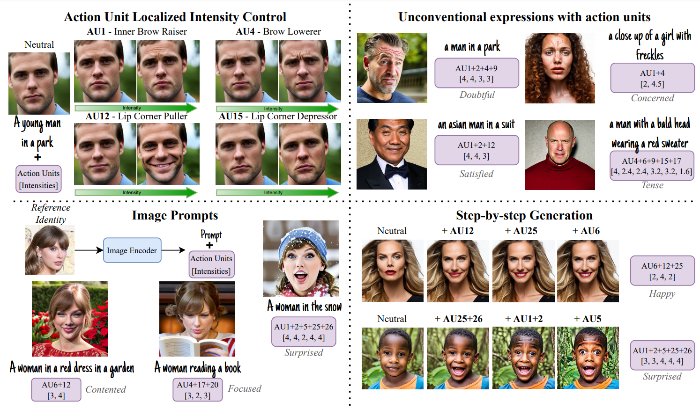
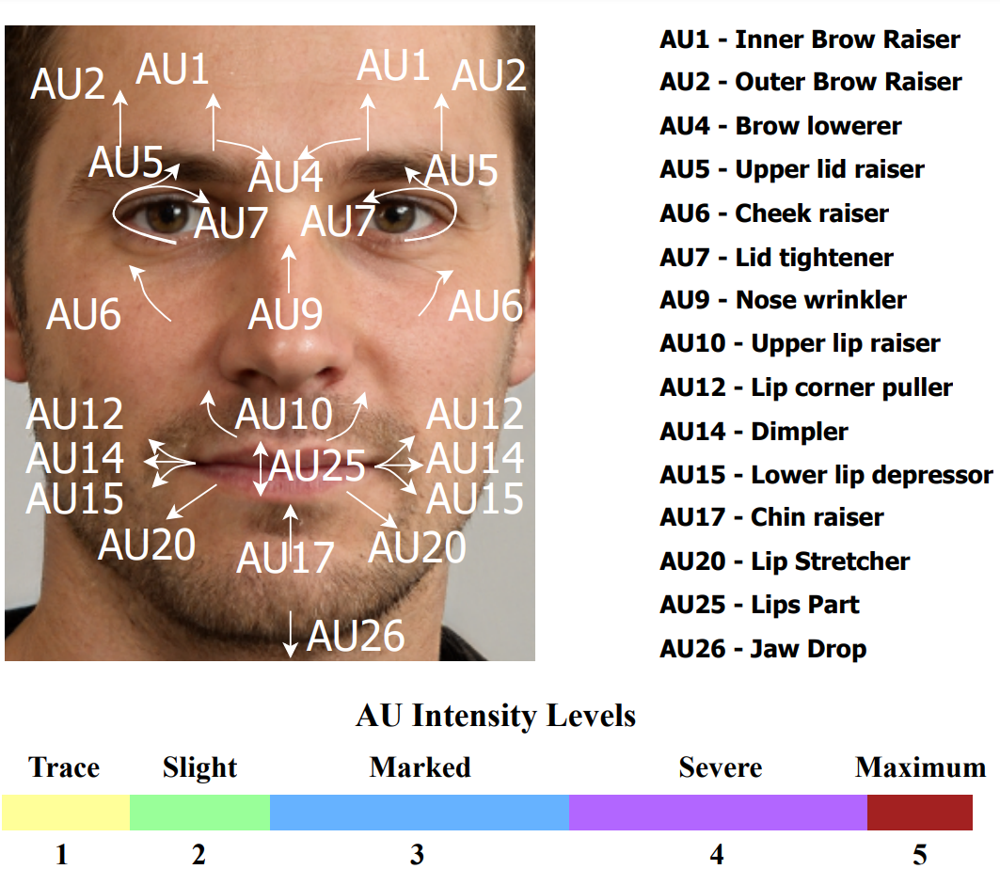

# FineFace
<b>[Towards Localized Fine-Grained Control for Facial Expression Generation](https://arxiv.org/abs/2407.20175)</b>

<a href='https://arxiv.org/abs/2407.20175'></a>



## Environment setup
```bash
conda create -n fineface python=3.11
conda activate fineface
pip install -r requirements.txt
```
## Running inference
Commandline:
Change prompt and AUs from the `demo.py` file
```bash
python demo.py
```
With python using diffusers
```python
from fineface import FineFacePipeline

pipe = FineFacePipeline()
prompt = "a closeup of a boy in a park"
aus = {"AU1": 2.5, "AU6": 2.5, "AU12": 5}
image = pipe(prompt, aus).images[0]
```
AU + IP-Adapter Pipeline
```python
from fineface import FineFaceIPAdapterPipeline

pipe = FineFaceIPAdapterPipeline()
faceid_embeds = torch.load("path_to_face_embeds.pt")
prompt = "a man as dark hooded emperor"
aus = {"AU4": 5, "AU6": 3}
image = pipe(prompt, aus, faceid_embeds, au_scale=1.0, ip_scale=0.9)
```

## Training
1. Download [DISFA](http://mohammadmahoor.com/disfa/) and [AffectNet](http://mohammadmahoor.com/affectnet/) datasets from their respesctive websites.
2. Download the *affecnet_metadata.csv* and *disfa_captions.csv* from [here](https://huggingface.co/Tvaranka/fineface/tree/main).
3. Modify the dataset paths in the `train.sh` script and run.

## What are Action Units (AUs)?
- Action Units are movements of facial muscles that are identified and used to break down facial expressions, like raising inner eyebrows (AU1).
- By mixing different AUs, it is possible to create complex facial expressions, with each AU adding its own unique intensity.
- See below for a quick overview.



For a more comprehensive understanding, see GIFs and images of each AU from [https://melindaozel.com/facs-cheat-sheet/](https://melindaozel.com/facs-cheat-sheet/).

## Citation

```
@varanka{varanka2024fineface,
      title={Towards Localized Fine-Grained Control for Facial Expression Generation}, 
      author={Tuomas Varanka and Huai-Qian Khor and Yante Li and Mengting Wei and Hanwei Kung and Nicu Sebe and Guoying Zhao},
      year={2024},
      eprint={2407.20175},
      archivePrefix={arXiv},
      primaryClass={cs.CV},
      url={https://arxiv.org/abs/2407.20175}, 
}
```
